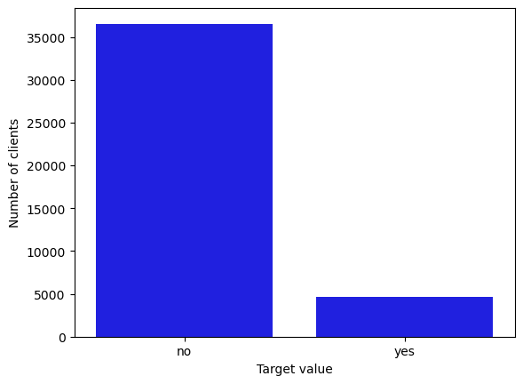
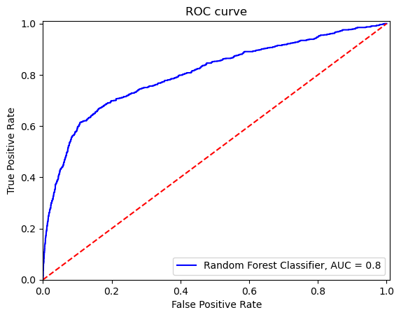
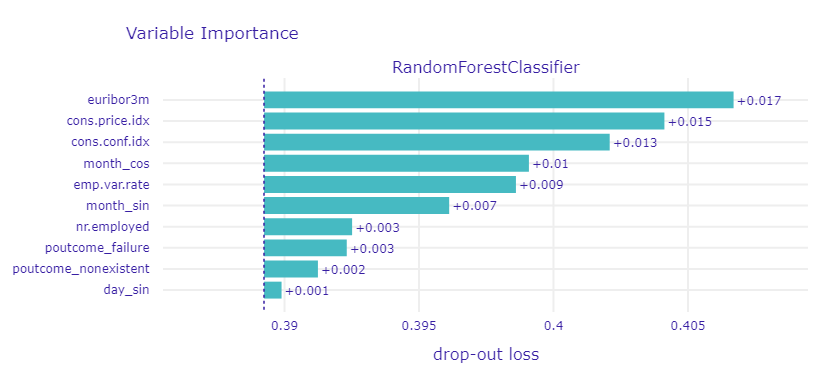
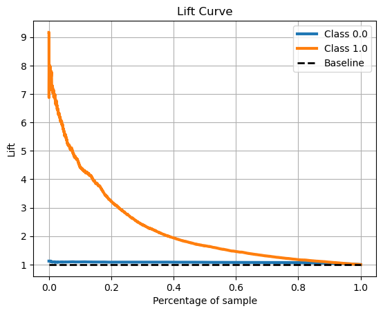
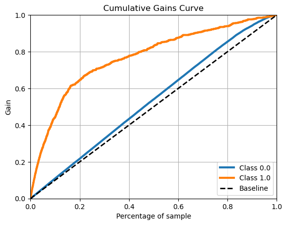

# KaggleProject - KNDS

## Bank marketing campaign analysis

- [KaggleProject - KNDS](#kaggleproject---knds)
  - [Bank marketing campaign analysis](#bank-marketing-campaign-analysis)
    - [Project motivation](#project-motivation)
    - [Problem description](#problem-description)
    - [Technologies](#technologies)
      - [Technologies used in the project](#technologies-used-in-the-project)
      - [How to run the project](#how-to-run-the-project)
    - [Repository structure](#repository-structure)
    - [Exploratory Data Analysis](#exploratory-data-analysis)
    - [Data cleaning](#data-cleaning)
    - [Feature engineering](#feature-engineering)
    - [Model building](#model-building)
    - [Explainable AI](#explainable-ai)

### Project motivation

Project realized with [Koło Naukowe Data Science PW](https://github.com/Kolo-Naukowe-Data-Science-PW). My goal was to learn basics of machine learning models building process.

### Problem description

In the project I'm working on [dataset](https://www.kaggle.com/datasets/volodymyrgavrysh/bank-marketing-campaigns-dataset) available on [kaggle](https://www.kaggle.com). It contains data that describes portugal bank marketing campaign results. The campaign was based on phone calls, offering bank's customer to open a term deposit. Our goal is to make a model that will predict whether the client placed the deposit or not.

### Technologies

#### Technologies used in the project

- __Python__
- __pandas__
- __numpy__
- __matplotlib__ and __seaborn__
- __scikit-learn__
- __dalex__

#### How to run the project

To run the project on your computer, download __requirements.txt__ file and run  

```
pip install -r requirements.txt
```

### Repository structure

```
├── Categorical_feature_preprocessing - script for categorical preprocessing of data
├── Data - all data files
├── Data_cleaning_and_feature_engineering - scripts for data cleaning and numerical preprocessing
├── EDA - notebook with Exploratory Data Analysis
├── Images - images for README
├── Models
│   ├── Hyperparameter_tuning - cross validation and optimalizing models
│   ├── Models_prototypes - non-optimalized models
│   ├── Serialized_models - pickled models
│   └── Serializing_scripts - scripts for serializing models
└── XAI - notebook with Explainable Artificial Intelligence
```

### Exploratory Data Analysis

In EDA I checked distribution of features, correlations between them and how target value affects them. I made first decisions to drop or transform some columns. Very important observation was noticing that target value is strongly unbalanaced, it had influence on future models building.

Distribution of target value:



### Data cleaning

I dropped columns I decided to drop in EDA and transformed __pdays__ column into binary __contacted.in.previous__ column. I decided to drop over 1000 records to get rid of *unknown* values in categorical features.

### Feature engineering

Firstly I determined outliers based on interquartile range and replaced them with winsorized mean. Then I checked skewness in features and normalized the distributions using power transformer. Finally, I scaled them to [0,1] range.

To deal with categorical columns I used one hot encoding. For __month__ and __day_of_week__ I used sine/cosine encoding.

### Model building

First step was the chose of models. I decided to try:

- Logistic Regression (used as baseline) (LOGR)
- Decision Tree Classifier (DTC)
- Random Forest Classifier (RFC)
- Multi-layer Perceptron Classifier (MLPC)
- Support Vector Classification model (SVC)

Then I started hyperparameter tuning. Results of cross-validation (average metrics of models on seen and unseen data):

|                   |      DTC |     LOGR |     MLPC |      RFC |      SVC |
|------------------:|---------:|---------:|---------:|---------:|----------|
|       avg_roc_auc | 0.780299 | 0.775719 | 0.783046 | 0.795506 | 0.746249 |
|  avg_seen_roc_auc | 0.792656 | 0.779792 | 0.802824 | 0.832813 | 0.747533 |
|      avg_accuracy | 0.844413 | 0.775732 | 0.898674 | 0.851860 | 0.718361 |
| avg_seen_accuracy | 0.844579 | 0.776007 | 0.900504 | 0.855489 | 0.718361 |

I used GridSearch to optimize hyperparameters. I decided to optimize models for the highest ROC AUC. Results of GS (metrics on test data):

|          |      DTC |     LOGR |     MLPC |      RFC |      SVC |
|---------:|---------:|---------:|---------:|---------:|----------|
|  ROC AUC | 0.783402 | 0.778021 | 0.794596 | 0.802916 | 0.778680 |
| Accuracy | 0.847524 | 0.778558 | 0.904201 | 0.856677 | 0.773417 |

Random Forest Classifier appeared to be best performing model.

ROC curve for Random Forest Classifier:



### Explainable AI

In XAI I tried to understand which features have biggest impact on classification, to achieve this I checked how different variables contribute to classification in patricular cases and what is the general features importance.

Most important features:



To analyze business value of the model I used Lift and Cumulative Gains curves.

Lift curve:



Cumulative gains curve:


